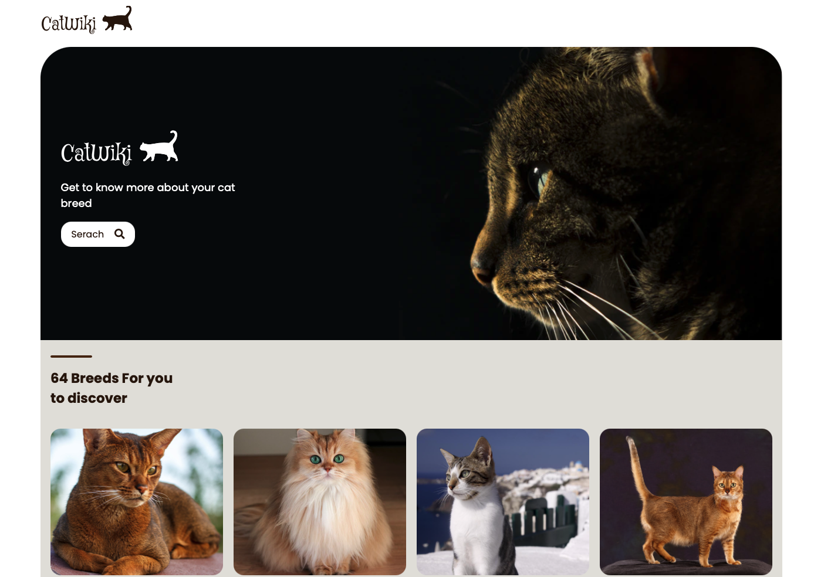

# CatWiki

You want to know more about cat breeds and check out an amazing collection of cat photos, this `Node`, `Express`, `React`, and `SASS` project is for you.

# Challenge

Beyond a good UI/UX (instantaneous search, 404 page...), the challenge was to alimente the app with data coming from `The Cat Api`, a third party api, but via my backend, so my front, does only interact with my backend.

# Overview

The project is hosted by `Heroku`, et and you can test it by clicking on the link above, in the `Github` about section. With the hope that, some one will find something interesting in this repository, it was your unknown friend !😉

